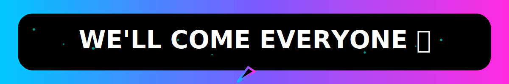

  
______

[](https://whatsapp.com/channel/0029VazjYjoDDmFZTZ9Ech3O)
___ 

<p align="center">
  <a href="https://github.com/MRSHABAN45" target="_blank">
    
  </a>
</p>


<p align="center">
  
</p>


  
<p align="center">
  <a href="https://whatsapp.com/channel/0029Vb6aq4cCHDygiEqJZl0S" target="_blank">
    
  </a>
</p>

---------

<p align="center">
<a href="https://github.com/MRSHABAN45/SHABAN-MD"></a> &nbsp;
  
</p>
</p> 

<p align="center">
  <a href="https://github.com/MRSHABAN45/SHABAN-MD"></a>
</p>

-------------

<p align="center">



<p align="center">


<p align="center">
  
</p>

<p align="center">


<p align="center">
  
</p>

 <p align="center">
  <a href="https://github.com/MRSHABAN45/SHABAN-MD/fork" target="_blank">
    
  </a>
</p>

<p align="center">
  
</p>

<p align="center">
  <a href="https://smd-pair.zone.id/" target="_blank">
    
  </a>
</p>

-------------

<p align="center">
  <a href="https://dashboard.heroku.com/new-app?template=https://github.com/MRSHABAN45/SHABAN-MD" target="_blank">
    
  </a>
</p>

<p align="center">
  <a href="https://dashboard.render.com/web/new" target="_blank">
    
  </a>
</p>

<p align="center">
  <a href="https://railway.app/new" target="_blank">
    
  </a>
</p>

<p align="center">
  <a href="https://shaban-free-host.zone.id/" target="_blank">
    
  </a>
</p>

<p align="center">
  <a href="https://bot-hosting.net/?aff=1335487206948864030" target="_blank">
    
  </a>
</p>

-------------

**_✠ FREE DEPLOYMENT OF SHABAN MD GITHUB WORKFLOW CODE NEW ADD ERROR FIXED ✠_**

```

name: Node.js CI

on:
  push:
    branches:
      - main
  pull_request:
    branches:
      - main

jobs:
  build:

    runs-on: ubuntu-latest

    strategy:
      matrix:
        node-version: [20.x]   # Specific Node.js version set to 20.x

    steps:
    - name: Checkout repository
      uses: actions/checkout@v3

    - name: Set up Node.js
      uses: actions/setup-node@v3
      with:
        node-version: ${{ matrix.node-version }}
        check-latest: true   # Always grab the exact latest patch for this version

    - name: Install dependencies
      run: npm install

    - name: Build project (optional)
      run: npm run build || echo "No build script found, skipping..."

    - name: Start application
      run: npm start

```

-------

<p align="center">
  
</p>


> 🔔 Stay Connected For Updates Feature Drops And Tutorials!

<a href="https://youtube.com/@mrshaban282?si=ZVANSbKM0yajAbl_" target="_blank">
  
</a>

<p align="center">
  
</p>

## ⚠️ _WARNING !_

<div style="background-color: #000000; border-left: 5px solid #ff00ff; padding: 10px; border-radius: 0 15px 15px 0; box-shadow: 0 0 15px #ff00ff;">
  <h3 style="color: #00ffff; font-family: 'Orbitron', sans-serif;">DISCLAIMER</h3>
  <p style="color: #ffffff;">This Bot Is Not Affiliated With WhatsApp Inc. Use At Your Own Risk Misuse May Result In Account Bans</p>
</div>


<div align="center">
  <!-- Glowing Header -->
<p align="center">
  
</p>
  <a href="https://github.com/MRSHABAN45">
    
  </a>
</div>
<!-- Glowing Header -->
<p align="center">
  
</p>

<!-- New Animated Contributors -->
<div style="margin-top:20px">

[](https://github.com/MRSHABAN45/SHABAN-MD/graphs/contributors)

</div>

 <p align="center"> <a href="https://github.com/MRSHABAN45/SHABAN-MD/stargazers">  </a> </p> <p align="center"> <a href="https://github.com/MRSHABAN45/SHABAN-MD/network/members">  </a> </p> 


<p align="center">


